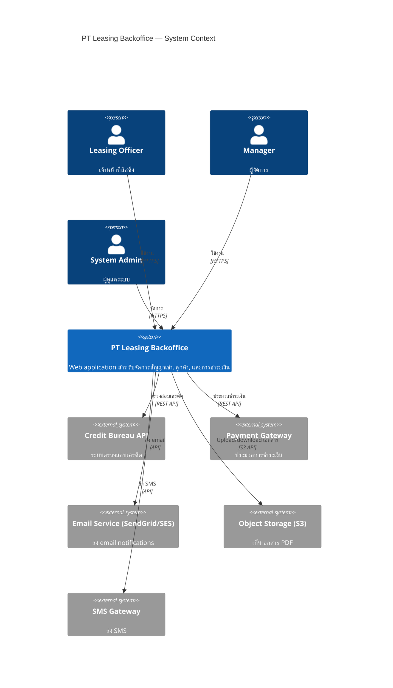

# System Architecture — PT Leasing Backoffice
# สถาปัตยกรรมระบบ

> **Version**: 0.1.0 | **Status**: Draft
> ดู ADRs สำหรับการตัดสินใจด้าน architecture: [adr/](adr/)

---

## Overview / ภาพรวม

PT Leasing Backoffice เป็นระบบ web application แบบ multi-tier ที่ออกแบบให้รองรับ 100+ concurrent users ด้วย architecture ที่ scalable และ maintainable

---

## Architecture Style / รูปแบบสถาปัตยกรรม

**Selected**: Monolithic Modular Architecture (ระยะแรก)
**Future**: Microservices (ตาม ADR-002)

เหตุผล: ขนาดทีมเล็ก (< 10 Dev) — monolith with clear module boundaries ง่ายกว่าในการพัฒนาและ maintain ระยะแรก

---

## System Context / บริบทระบบ

---

## Component Architecture / สถาปัตยกรรมส่วนประกอบ

*(กรอกรายละเอียดหลัง architecture decisions finalised)*

### Technology Stack Summary

| Layer | Technology | Rationale |
|-------|-----------|-----------|
| Frontend | React 18 + TypeScript | — *(ดู ADR-00X)* |
| Backend | Node.js + Express | — *(ดู ADR-00X)* |
| Database | PostgreSQL 15 | — *(ดู ADR-00X)* |
| Cache | Redis 7 | Session, cache |
| Container | Docker | Consistency |
| Orchestration | Kubernetes / Docker Compose | Scalability |
| CI/CD | GitHub Actions | Repository integration |

ดู [TECH_STACK.md](TECH_STACK.md) สำหรับรายละเอียดเพิ่มเติม

---

## Architecture Decisions / การตัดสินใจ Architecture

ดู [adr/](adr/) สำหรับ Architecture Decision Records ทั้งหมด

| ADR | Title | Status |
|-----|-------|--------|
| ADR-0001 | Use Jira as task tracking system | Accepted |

---

*อัปเดตล่าสุด: 2026-05-15 | Owner: siriporn.san@snocko-tech.com*
