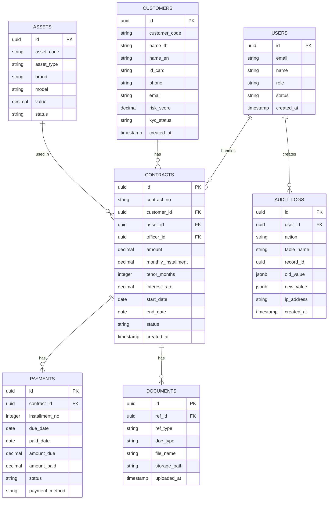
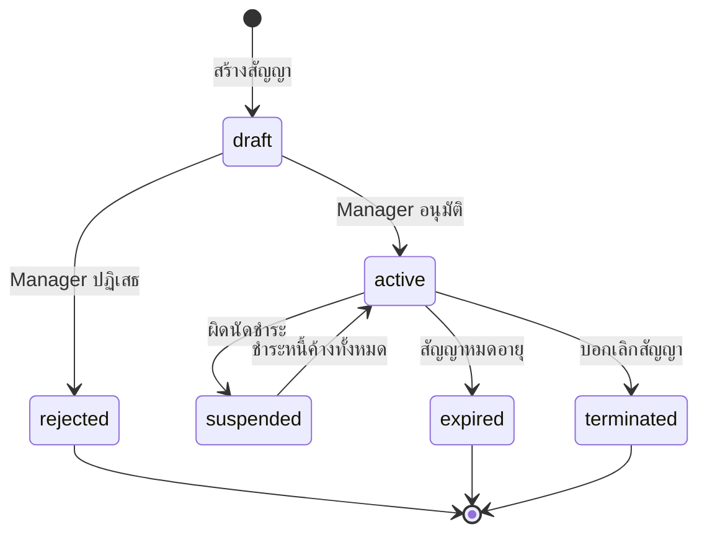

# Data Structure / โครงสร้างข้อมูล

> **Version**: 0.1.0 | **Status**: Draft

---

## Overview / ภาพรวม

เอกสารนี้อธิบาย data model หลักของระบบ PT Leasing Backoffice รวมถึง entity relationships

---

## Entity Relationship Diagram / ผัง ER

---

## Table Definitions / นิยามตาราง

### Table: contracts

| Column | Type | Nullable | Default | Description |
|--------|------|---------|---------|-------------|
| id | UUID | NOT NULL | gen_random_uuid() | Primary key |
| contract_no | VARCHAR(20) | NOT NULL | — | รหัสสัญญา (CTR-YYYY-XXXXXX) |
| customer_id | UUID | NOT NULL | — | FK → customers.id |
| asset_id | UUID | NOT NULL | — | FK → assets.id |
| officer_id | UUID | NOT NULL | — | FK → users.id |
| amount | DECIMAL(15,2) | NOT NULL | — | มูลค่าสัญญา |
| monthly_installment | DECIMAL(12,2) | NOT NULL | — | ค่างวดรายเดือน |
| tenor_months | INTEGER | NOT NULL | — | ระยะเวลา (เดือน) |
| interest_rate | DECIMAL(5,4) | NOT NULL | — | อัตราดอกเบี้ยต่อปี |
| start_date | DATE | NOT NULL | — | วันเริ่มต้น |
| end_date | DATE | NOT NULL | — | วันสิ้นสุด |
| status | ENUM | NOT NULL | 'draft' | draft, active, suspended, terminated, expired |
| created_at | TIMESTAMPTZ | NOT NULL | NOW() | — |
| updated_at | TIMESTAMPTZ | NOT NULL | NOW() | — |

**Indexes**:
- `contracts_contract_no_idx` UNIQUE on `contract_no`
- `contracts_customer_id_idx` on `customer_id`
- `contracts_status_idx` on `status`
- `contracts_end_date_idx` on `end_date` (for renewal queries)

---

### Table: customers

*(กรอกรายละเอียด columns ให้ครบหลังได้รับ requirements)*

---

### Table: payments

*(กรอกรายละเอียด columns ให้ครบหลังได้รับ requirements)*

---

## Data Lifecycle / วงจรชีวิตข้อมูล

### Contract Status Transitions

---

## Sensitive Data Fields / Fields ข้อมูลสำคัญ

ข้อมูลเหล่านี้ต้องได้รับการปกป้องพิเศษตาม PDPA:

| Table | Column | Sensitivity | Handling |
|-------|--------|------------|---------|
| customers | id_card | PII - High | Encrypt at rest |
| customers | phone | PII - Medium | Mask in logs |
| customers | email | PII - Medium | Mask in logs |
| customers | bank_account | Financial - High | Encrypt at rest |
| audit_logs | ip_address | PII - Low | Retain 90 days |

---

*อัปเดตล่าสุด: 2026-05-15 | Owner: siriporn.san@snocko-tech.com*
