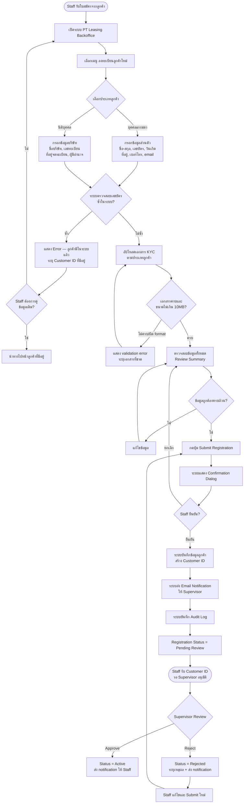
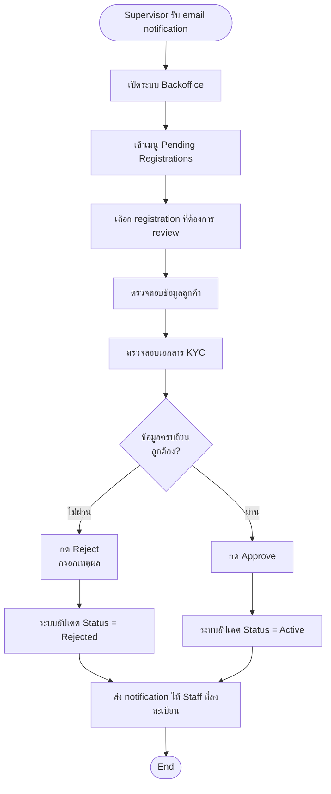
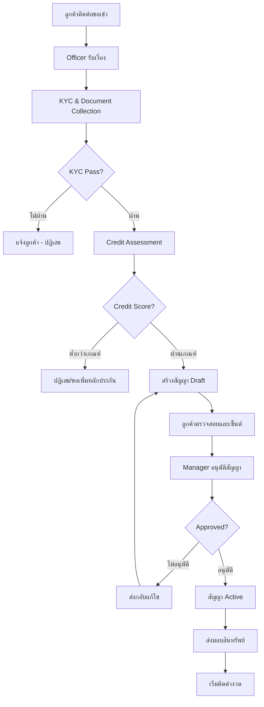
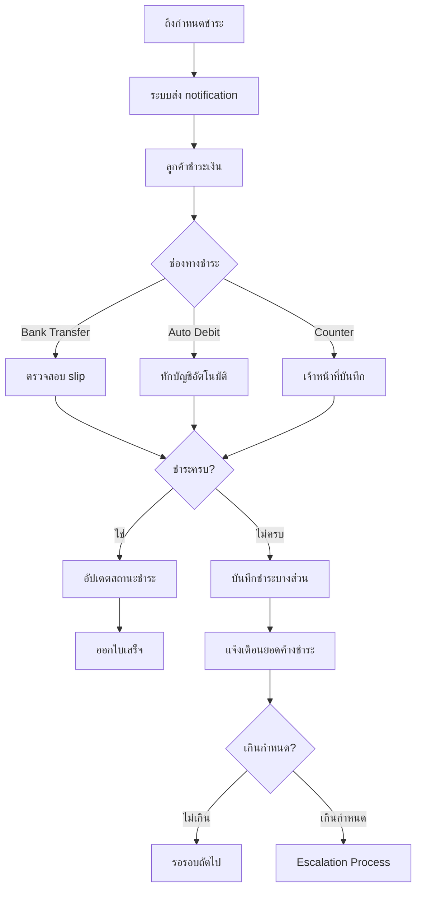
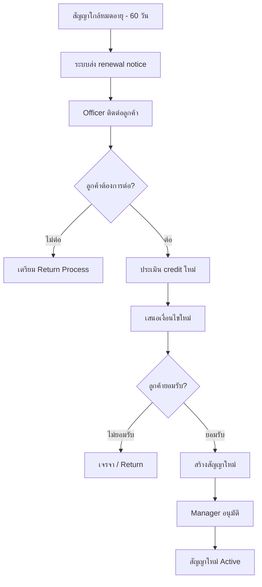

# Business Flow — PT Leasing Backoffice
# กระบวนการธุรกิจ

> **Version**: 1.0.0 | **Status**: Final | **Feature**: F-001 Customer Registration

---

## Overview / ภาพรวม

เอกสารนี้อธิบาย business flow หลักของระบบ PT Leasing Backoffice ครอบคลุมทุก business process ตั้งแต่ต้นจนจบ

---

## F-001: Customer Registration Flow / กระบวนการลงทะเบียนลูกค้า

### To-Be Process (Web Backoffice System)

---

### As-Is Process (Excel/กระดาษ) vs To-Be Process (Web System)

| ขั้นตอน | As-Is (ปัจจุบัน) | To-Be (ระบบใหม่) | ประโยชน์ที่ได้ |
|--------|-----------------|-----------------|--------------|
| รับข้อมูลลูกค้า | Staff กรอก Excel template | กรอกฟอร์มใน Web UI | Real-time validation |
| ตรวจสอบข้อมูลซ้ำ | ค้นหา manual ใน Excel | ระบบตรวจสอบอัตโนมัติ | ป้องกัน duplicate 100% |
| รับเอกสาร KYC | รับเป็น hardcopy หรือ email attachment | อัปโหลดใน web form | ไม่สูญหาย, เข้าถึงได้ทุกที่ |
| ส่งให้ Supervisor | ส่ง email พร้อม attachment | Submit ผ่าน workflow | Track status ได้ real-time |
| Supervisor Review | Reply email | Approve/Reject ในระบบ | Audit trail ครบถ้วน |
| บันทึก Audit | ไม่มี | อัตโนมัติทุก action | PDPA compliance |
| เวลาเฉลี่ย | 30 นาที/ราย | ≤ 10 นาที/ราย | ลดเวลา 67% |

---

### Supervisor Approval Sub-Flow

---

## Main Business Processes อื่นๆ / Other Business Processes

### 1. Contract Creation Flow / กระบวนการสร้างสัญญา

---

### 2. Payment Processing Flow / กระบวนการชำระเงิน

---

### 3. Contract Renewal Flow / กระบวนการต่ออายุสัญญา

---

## Business Rules Summary / สรุปกฎธุรกิจ

### F-001 Customer Registration Business Rules

| Rule ID | Category | Description | Flow Step |
|---------|---------|-------------|-----------|
| BR-001 | Uniqueness | เลขบัตรประชาชน 13 หลักต้องไม่ซ้ำในระบบ | ขั้นตอนตรวจสอบ duplicate |
| BR-002 | KYC Completeness | เอกสาร KYC ต้องครบตามประเภทลูกค้าก่อน submit | ขั้นตอนอัปโหลดเอกสาร |
| BR-003 | Data Classification | ข้อมูลลูกค้าทั้งหมดเป็น Confidential (PDPA) | ทุกขั้นตอน |
| BR-004 | Approval Required | Registration ทุกรายต้องผ่าน Supervisor approve | ขั้นตอน submit → review |
| BR-005 | Age Validation | ลูกค้าบุคคลธรรมดาอายุ ≥ 20 ปี | ขั้นตอนกรอกข้อมูล |
| BR-006 | Audit Trail | บันทึก audit log ทุก action | ทุกขั้นตอน |
| BR-007 | File Size | เอกสาร KYC แต่ละไฟล์ ≤ 10 MB | ขั้นตอน upload |

### Other Business Rules (ระบบอื่น)

| Rule ID | Category | Description |
|---------|---------|-------------|
| BR-C001 | Contract | สัญญาต้องได้รับ approval จาก Manager ก่อน activate |
| BR-C002 | Credit | Credit score ต้องสูงกว่า threshold จึงผ่านได้ |
| BR-P001 | Payment | Grace period 7 วันหลังครบกำหนด |
| BR-KYC001 | KYC | ต้องมีเอกสาร: บัตรประชาชน, ทะเบียนบ้าน, รายได้ |
| BR-R001 | Renewal | ต้องแจ้งลูกค้าล่วงหน้า 60 วันก่อนสัญญาหมด |

---

*Document ID: PTL-BF-001 | Version: 1.0.0 | อัปเดตล่าสุด: 2026-05-15 | Owner: orawan.nus@snocko-tech.com*
