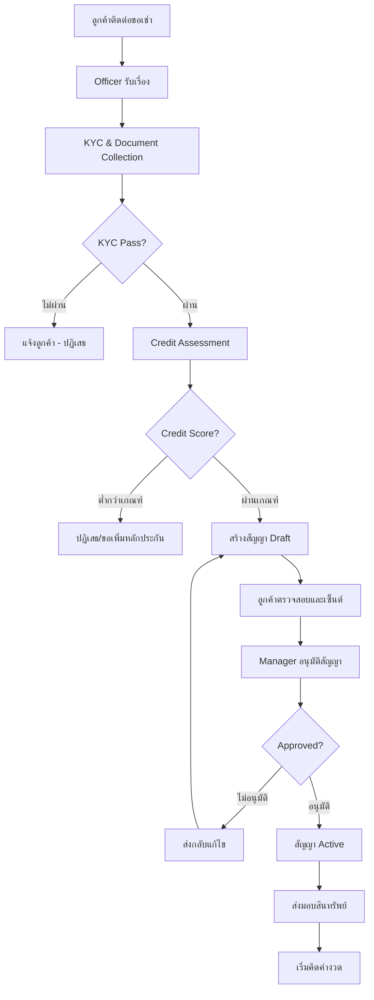
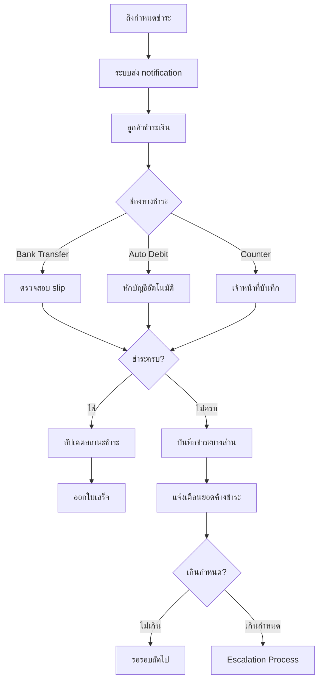
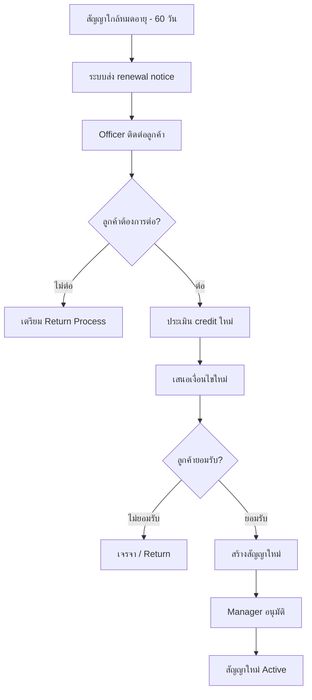

# Business Flow — PT Leasing Backoffice
# กระบวนการธุรกิจ

> **Version**: 0.1.0 | **Status**: Draft

---

## Overview / ภาพรวม

เอกสารนี้อธิบาย business flow หลักของระบบ PT Leasing Backoffice ครอบคลุมทุก business process ตั้งแต่ต้นจนจบ

---

## Main Business Processes / กระบวนการธุรกิจหลัก

### 1. Contract Creation Flow / กระบวนการสร้างสัญญา

---

### 2. Payment Processing Flow / กระบวนการชำระเงิน

---

### 3. Contract Renewal Flow / กระบวนการต่ออายุสัญญา

---

## Business Rules Summary / สรุปกฎธุรกิจ

*(กรอกรายละเอียดหลังได้รับ requirements จาก stakeholders)*

| Rule ID | Category | Description |
|---------|---------|-------------|
| BR-001 | Contract | สัญญาต้องได้รับ approval จาก Manager ก่อน activate |
| BR-002 | Credit | Credit score ต้องสูงกว่า [threshold] จึงผ่านได้ |
| BR-003 | Payment | Grace period [X] วันหลังครบกำหนด |
| BR-004 | KYC | ต้องมีเอกสาร: บัตรประชาชน, ทะเบียนบ้าน, รายได้ |
| BR-005 | Renewal | ต้องแจ้งลูกค้าล่วงหน้า [X] วันก่อนสัญญาหมด |

---

*อัปเดตล่าสุด: 2026-05-15 | Owner: orawan.nus@snocko-tech.com*
