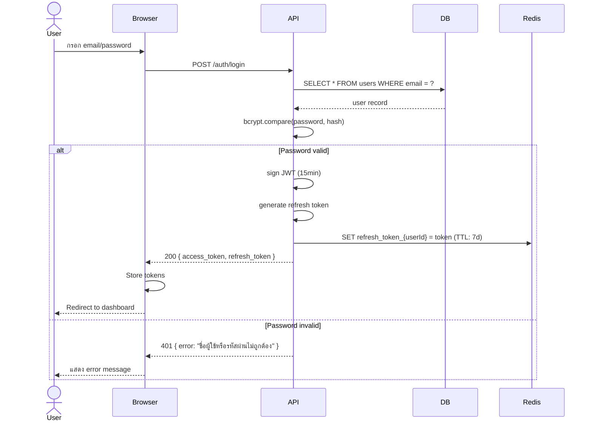
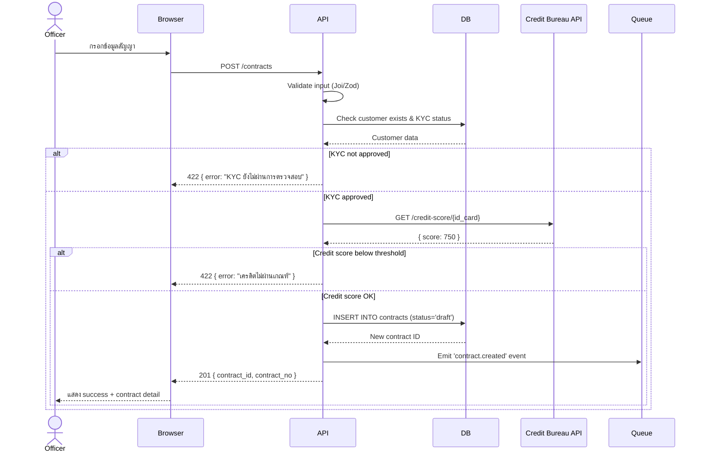
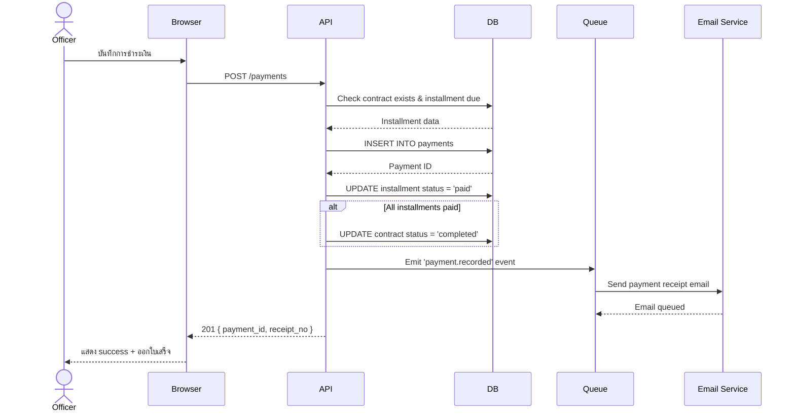
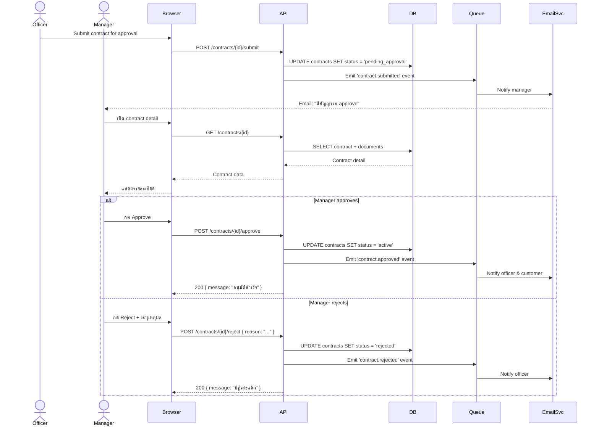

# Sequence Diagrams / ผัง Sequence

> **Version**: 0.1.0 | **Status**: Draft

---

## 1. Login Flow

---

## 2. Create Contract Flow

---

## 3. Payment Recording Flow

---

## 4. Contract Approval Flow

---

*อัปเดตล่าสุด: 2026-05-15 | Owner: siriporn.san@snocko-tech.com*
