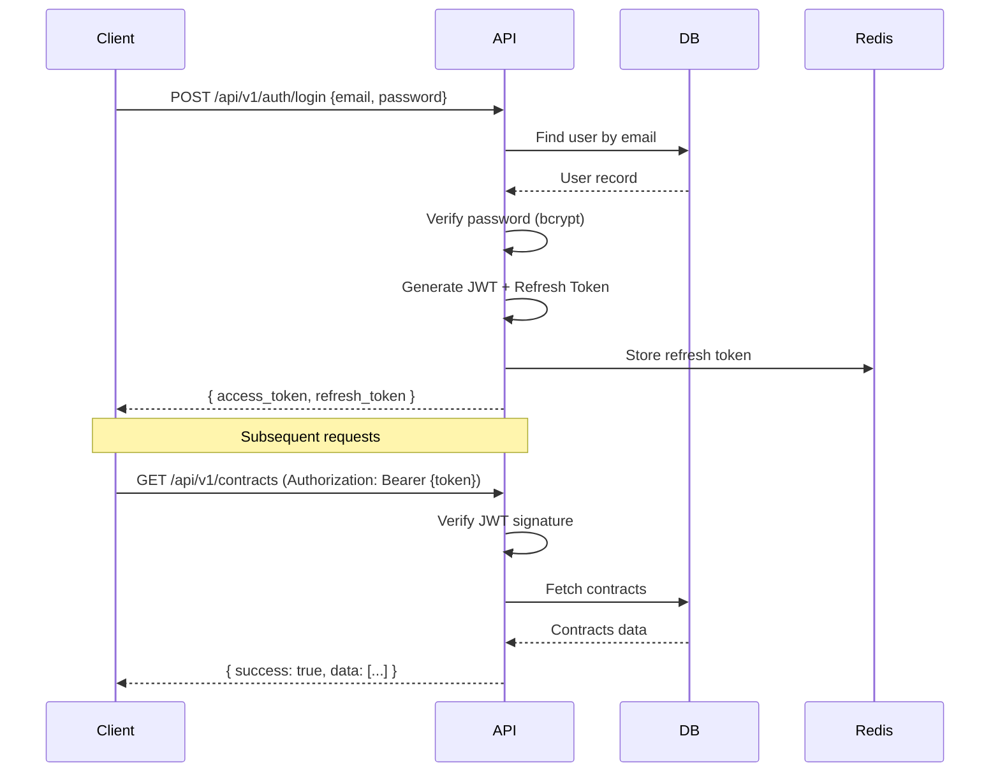

# System Design — PT Leasing Backoffice
# การออกแบบระบบ

> **Version**: 0.1.0 | **Status**: Draft

---

## Overview / ภาพรวม

เอกสารนี้อธิบาย system design รวมถึง module structure, API design principles, error handling strategy, และ caching strategy

---

## Module Structure / โครงสร้าง Modules

```
src/
├── modules/
│   ├── auth/           Authentication & Authorization
│   ├── contracts/      Contract management
│   ├── customers/      Customer management
│   ├── payments/       Payment processing
│   ├── assets/         Asset management
│   ├── reports/        Reporting
│   ├── notifications/  Email/SMS notifications
│   └── admin/          System administration
├── shared/
│   ├── middleware/     Auth, logging, error handling
│   ├── utils/          Helper functions
│   ├── validators/     Input validation schemas
│   └── types/          TypeScript types
└── infrastructure/
    ├── database/       DB connection, migrations
    ├── cache/          Redis connection
    ├── storage/        S3/MinIO client
    └── queue/          Job queue
```

---

## API Design Standards / มาตรฐาน API

### Base URL
```
/api/v1/[resource]
```

### HTTP Methods
| Method | Usage |
|--------|-------|
| GET | ดึงข้อมูล (idempotent) |
| POST | สร้างข้อมูลใหม่ |
| PUT | อัปเดตทั้ง resource |
| PATCH | อัปเดตบางส่วน |
| DELETE | ลบข้อมูล |

### Response Format
```json
{
  "success": true,
  "data": { },
  "message": "Operation successful",
  "pagination": {
    "page": 1,
    "per_page": 20,
    "total": 100,
    "total_pages": 5
  }
}
```

### Error Response Format
```json
{
  "success": false,
  "error": {
    "code": "VALIDATION_ERROR",
    "message": "ข้อมูลไม่ถูกต้อง",
    "details": [
      { "field": "email", "message": "รูปแบบ email ไม่ถูกต้อง" }
    ]
  }
}
```

### HTTP Status Codes
| Code | Usage |
|------|-------|
| 200 | Success |
| 201 | Created |
| 204 | No Content (DELETE) |
| 400 | Bad Request (validation error) |
| 401 | Unauthorized (not authenticated) |
| 403 | Forbidden (not authorized) |
| 404 | Not Found |
| 409 | Conflict (duplicate) |
| 422 | Unprocessable Entity |
| 429 | Too Many Requests |
| 500 | Internal Server Error |

---

## Authentication Flow / ขั้นตอน Authentication



---

## Error Handling Strategy / กลยุทธ์การจัดการ Error

1. **Input Validation**: Validate ทุก request ก่อนถึง business logic (ใช้ Joi/Zod)
2. **Business Logic Errors**: Return 422 พร้อม error code ที่ชัดเจน
3. **External API Failures**: Retry 3 times with exponential backoff
4. **Database Errors**: Log และ return 500 โดยไม่ expose stack trace
5. **Audit Log**: บันทึกทุก error พร้อม context สำหรับ debugging

---

## Caching Strategy / กลยุทธ์ Cache

| Data | TTL | Strategy |
|------|-----|---------|
| User session | 30 min | Redis |
| User permissions | 5 min | Redis |
| Reference data (roles, statuses) | 1 hour | Redis |
| Contract list (per user) | 30 sec | Redis |
| Reports | 5 min | Redis |
| Static assets | 1 year | CDN/Browser |

---

*อัปเดตล่าสุด: 2026-05-15 | Owner: siriporn.san@snocko-tech.com*
