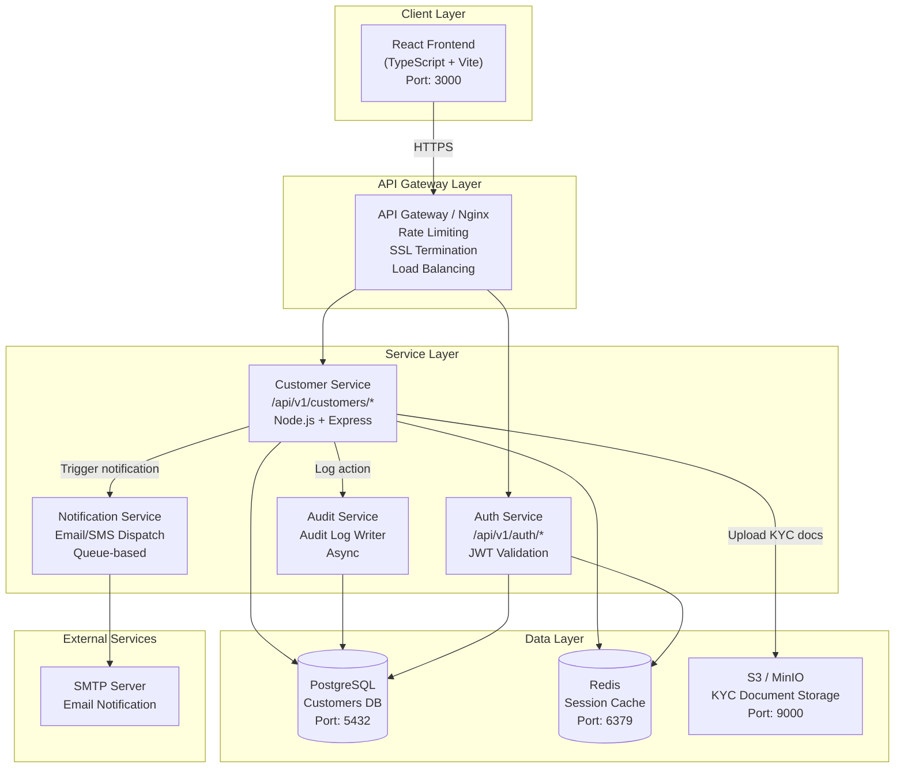
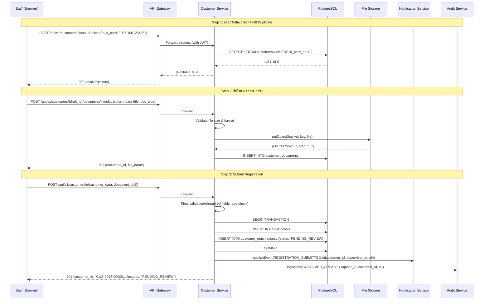
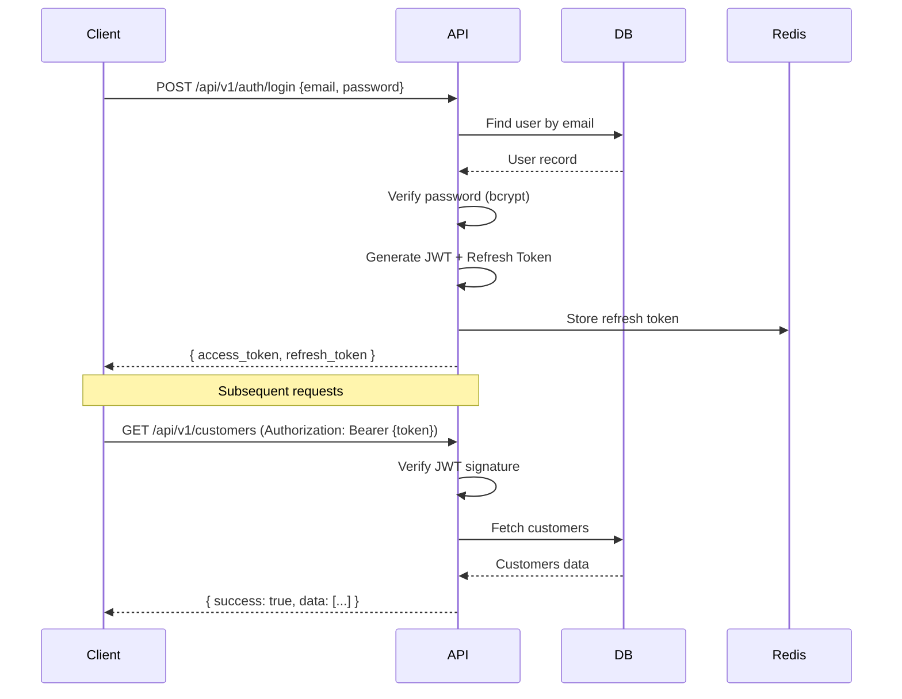

# System Design — PT Leasing Backoffice
# การออกแบบระบบ

> **Version**: 1.0.0 | **Status**: Final | **Feature**: F-001 Customer Registration

---

## Overview / ภาพรวม

เอกสารนี้อธิบาย system design รวมถึง component architecture, data flow, module structure, API design principles, error handling strategy, และ caching strategy สำหรับ PT Leasing Backoffice โดยเฉพาะ F-001 Customer Registration Module

---

## F-001: Component Architecture Diagram



---

## F-001: Data Flow — Customer Registration



---

## Module Structure / โครงสร้าง Modules

```
src/
├── modules/
│   ├── auth/                   Authentication & Authorization
│   │   ├── auth.controller.ts
│   │   ├── auth.service.ts
│   │   └── auth.middleware.ts
│   ├── customers/              Customer Management (F-001)
│   │   ├── customers.controller.ts
│   │   ├── customers.service.ts
│   │   ├── customers.repository.ts
│   │   ├── customers.validator.ts
│   │   ├── customers.types.ts
│   │   └── customers.test.ts
│   ├── documents/              KYC Document Upload (F-001)
│   │   ├── documents.controller.ts
│   │   ├── documents.service.ts
│   │   └── documents.storage.ts
│   ├── contracts/              Contract management
│   ├── payments/               Payment processing
│   ├── assets/                 Asset management
│   ├── reports/                Reporting
│   ├── notifications/          Email/SMS notifications
│   │   ├── notification.service.ts
│   │   └── templates/
│   │       └── registration-submitted.html
│   └── admin/                  System administration
├── shared/
│   ├── middleware/             Auth, logging, error handling
│   │   ├── auth.middleware.ts
│   │   ├── audit.middleware.ts
│   │   └── error.middleware.ts
│   ├── utils/                  Helper functions
│   │   └── id-card.validator.ts
│   ├── validators/             Input validation schemas
│   │   └── customer.schema.ts
│   └── types/                  TypeScript types
│       └── customer.types.ts
└── infrastructure/
    ├── database/               DB connection, migrations
    │   └── migrations/
    │       └── 001_create_customers_table.sql
    ├── cache/                  Redis connection
    ├── storage/                S3/MinIO client
    └── queue/                  Job queue (notification, audit)
```

---

## Database Schema — F-001 Customer Registration

### Table: customers

```sql
CREATE TABLE customers (
    id              UUID PRIMARY KEY DEFAULT gen_random_uuid(),
    customer_no     VARCHAR(20) UNIQUE NOT NULL,  -- CUS-2026-000001
    customer_type   ENUM('INDIVIDUAL', 'JURISTIC') NOT NULL,

    -- Individual fields
    first_name      VARCHAR(100),
    last_name       VARCHAR(100),
    id_card_no      VARCHAR(13) UNIQUE,            -- encrypted
    date_of_birth   DATE,

    -- Juristic fields
    company_name    VARCHAR(200),
    juristic_no     VARCHAR(13) UNIQUE,            -- เลขทะเบียนนิติบุคคล
    authorized_person_name    VARCHAR(200),
    authorized_person_id_card VARCHAR(13),         -- encrypted

    -- Common fields
    address_current  TEXT,
    address_registered TEXT,
    phone           VARCHAR(20),                   -- encrypted
    email           VARCHAR(150),
    emergency_contact_name  VARCHAR(200),
    emergency_contact_phone VARCHAR(20),

    -- Status
    status          ENUM('PENDING_REVIEW', 'ACTIVE', 'REJECTED', 'INACTIVE')
                    NOT NULL DEFAULT 'PENDING_REVIEW',
    rejection_reason TEXT,

    -- Metadata
    registered_by   UUID REFERENCES users(id) NOT NULL,
    reviewed_by     UUID REFERENCES users(id),
    reviewed_at     TIMESTAMPTZ,
    created_at      TIMESTAMPTZ NOT NULL DEFAULT NOW(),
    updated_at      TIMESTAMPTZ NOT NULL DEFAULT NOW(),
    deleted_at      TIMESTAMPTZ  -- soft delete
);

CREATE INDEX idx_customers_id_card ON customers(id_card_no);
CREATE INDEX idx_customers_juristic_no ON customers(juristic_no);
CREATE INDEX idx_customers_status ON customers(status);
CREATE INDEX idx_customers_created_at ON customers(created_at DESC);
```

### Table: customer_documents

```sql
CREATE TABLE customer_documents (
    id              UUID PRIMARY KEY DEFAULT gen_random_uuid(),
    customer_id     UUID REFERENCES customers(id) NOT NULL,
    document_type   ENUM('ID_CARD', 'HOUSE_REGISTRATION', 'COMPANY_CERTIFICATE',
                         'POWER_OF_ATTORNEY', 'INCOME_STATEMENT', 'OTHER') NOT NULL,
    file_name       VARCHAR(255) NOT NULL,
    file_size_bytes INTEGER NOT NULL,
    mime_type       VARCHAR(100) NOT NULL,
    storage_key     TEXT NOT NULL,       -- S3 key (private, not URL)
    uploaded_by     UUID REFERENCES users(id) NOT NULL,
    created_at      TIMESTAMPTZ NOT NULL DEFAULT NOW()
);
```

### Table: audit_logs

```sql
CREATE TABLE audit_logs (
    id          UUID PRIMARY KEY DEFAULT gen_random_uuid(),
    user_id     UUID REFERENCES users(id) NOT NULL,
    action      VARCHAR(100) NOT NULL,   -- CUSTOMER_CREATED, DOCUMENT_UPLOADED, etc.
    resource    VARCHAR(100) NOT NULL,   -- customers, customer_documents
    resource_id UUID,
    ip_address  VARCHAR(45),
    user_agent  TEXT,
    old_values  JSONB,
    new_values  JSONB,
    created_at  TIMESTAMPTZ NOT NULL DEFAULT NOW()
);
CREATE INDEX idx_audit_logs_user_id ON audit_logs(user_id);
CREATE INDEX idx_audit_logs_resource ON audit_logs(resource, resource_id);
CREATE INDEX idx_audit_logs_created_at ON audit_logs(created_at DESC);
```

---

## API Endpoints — F-001 Customer Registration

| Method | Endpoint | Description | Auth Role |
|--------|----------|-------------|-----------|
| POST | `/api/v1/customers` | สร้างลูกค้าใหม่ | OFFICER+ |
| GET | `/api/v1/customers` | ค้นหา/รายการลูกค้า | OFFICER+ |
| GET | `/api/v1/customers/:id` | ดึงข้อมูลลูกค้า | OFFICER+ |
| PUT | `/api/v1/customers/:id` | แก้ไขข้อมูลลูกค้า (PENDING เท่านั้น) | OFFICER+ |
| POST | `/api/v1/customers/:id/documents` | อัปโหลดเอกสาร KYC | OFFICER+ |
| GET | `/api/v1/customers/:id/documents` | รายการเอกสารของลูกค้า | OFFICER+ |
| POST | `/api/v1/customers/:id/approve` | Approve registration | MANAGER+ |
| POST | `/api/v1/customers/:id/reject` | Reject registration | MANAGER+ |
| GET | `/api/v1/customers/check-duplicate` | ตรวจสอบ duplicate | OFFICER+ |

> รายละเอียด request/response schema: ดูที่ [API_SPEC.md](./API_SPEC.md)

---

## API Design Standards / มาตรฐาน API

### Base URL

```
Production:  https://api.ptleasing.snocko-tech.com/api/v1
Staging:     https://api-staging.ptleasing.snocko-tech.com/api/v1
Development: http://localhost:3000/api/v1
```

### HTTP Methods

| Method | Usage |
|--------|-------|
| GET | ดึงข้อมูล (idempotent) |
| POST | สร้างข้อมูลใหม่ |
| PUT | อัปเดตทั้ง resource |
| PATCH | อัปเดตบางส่วน |
| DELETE | ลบข้อมูล |

### Response Format

```json
{
  "success": true,
  "data": { },
  "message": "Operation successful",
  "pagination": {
    "page": 1,
    "per_page": 20,
    "total": 100,
    "total_pages": 5
  }
}
```

### Error Response Format

```json
{
  "success": false,
  "error": {
    "code": "VALIDATION_ERROR",
    "message": "ข้อมูลไม่ถูกต้อง",
    "details": [
      { "field": "id_card_no", "message": "เลขบัตรประชาชนต้องมี 13 หลัก" }
    ]
  }
}
```

### HTTP Status Codes

| Code | Usage |
|------|-------|
| 200 | Success |
| 201 | Created |
| 204 | No Content (DELETE) |
| 400 | Bad Request (validation error) |
| 401 | Unauthorized (not authenticated) |
| 403 | Forbidden (not authorized) |
| 404 | Not Found |
| 409 | Conflict (duplicate) |
| 422 | Unprocessable Entity |
| 429 | Too Many Requests |
| 500 | Internal Server Error |

---

## Authentication Flow / ขั้นตอน Authentication



---

## Error Handling Strategy / กลยุทธ์การจัดการ Error

1. **Input Validation**: Validate ทุก request ด้วย Zod schema ก่อนถึง business logic
2. **Duplicate Check**: ตรวจสอบก่อน INSERT ด้วย unique constraint + application-level check
3. **Business Logic Errors**: Return 422 พร้อม error code ที่ชัดเจน (เช่น DUPLICATE_ID_CARD, AGE_BELOW_MINIMUM)
4. **File Upload Errors**: Validate mime type และ file size ก่อน upload ไปยัง S3
5. **External API Failures**: Retry 3 times with exponential backoff สำหรับ S3 และ SMTP
6. **Database Errors**: Log และ return 500 โดยไม่ expose stack trace หรือ internal details
7. **Audit Log**: บันทึกทุก error พร้อม context สำหรับ debugging (async, ไม่กระทบ response)

### Application Error Codes (F-001)

| Error Code | HTTP Status | Description |
|-----------|------------|-------------|
| DUPLICATE_ID_CARD | 409 | เลขบัตรประชาชนซ้ำ |
| DUPLICATE_JURISTIC_NO | 409 | เลขทะเบียนนิติบุคคลซ้ำ |
| AGE_BELOW_MINIMUM | 422 | อายุต่ำกว่า 20 ปี |
| MISSING_KYC_DOCUMENTS | 422 | เอกสาร KYC ไม่ครบ |
| FILE_TOO_LARGE | 400 | ไฟล์เกิน 10 MB |
| INVALID_FILE_TYPE | 400 | ประเภทไฟล์ไม่รองรับ |
| CUSTOMER_NOT_FOUND | 404 | ไม่พบลูกค้า |
| CANNOT_MODIFY_ACTIVE | 422 | ไม่สามารถแก้ไขลูกค้า Active ได้ |

---

## Caching Strategy / กลยุทธ์ Cache

| Data | TTL | Strategy |
|------|-----|---------|
| User session | 30 min | Redis |
| User permissions | 5 min | Redis |
| Reference data (roles, statuses) | 1 hour | Redis |
| Customer list (per user) | 30 sec | Redis |
| Reports | 5 min | Redis |
| Static assets | 1 year | CDN/Browser |

---

*Document ID: PTL-SYS-001 | Version: 1.0.0 | อัปเดตล่าสุด: 2026-05-15 | Owner: siriporn.san@snocko-tech.com*
