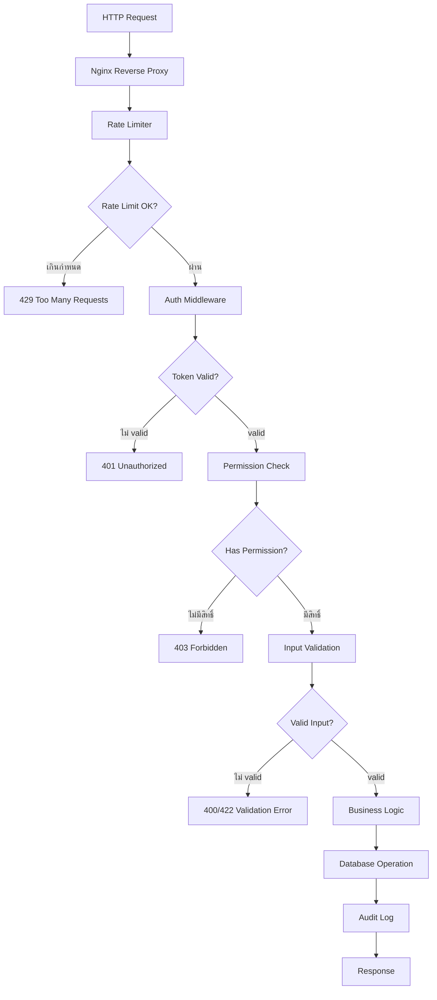
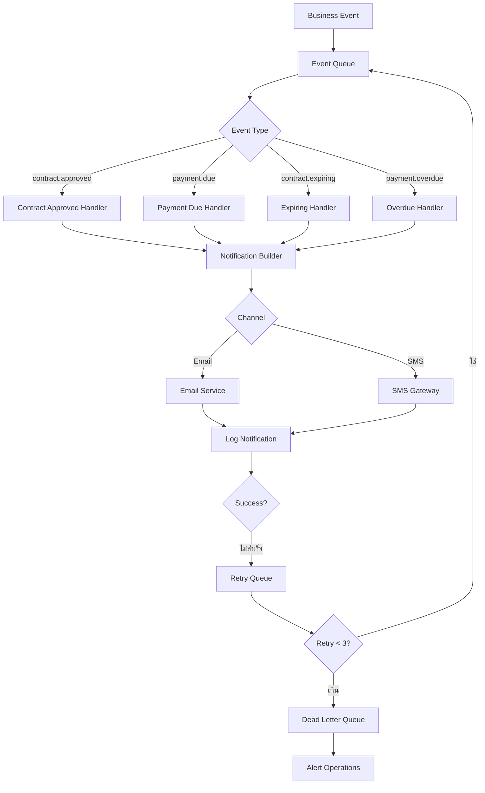
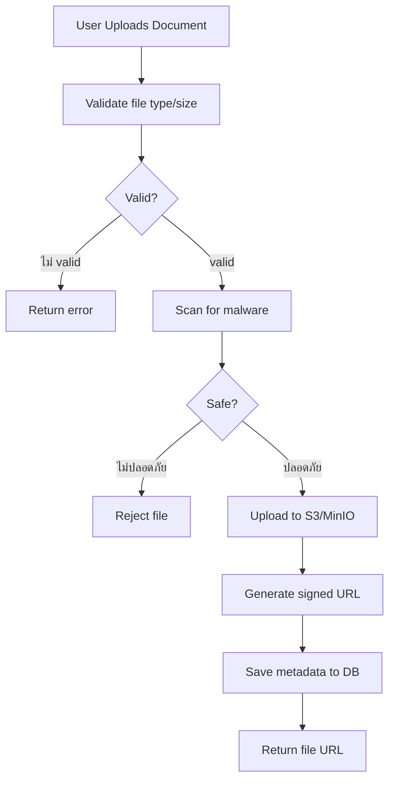

# System Flow / ระบบ Flow

> **Version**: 0.1.0 | **Status**: Draft

---

## Overview / ภาพรวม

เอกสารนี้อธิบาย system flow หลักจากมุมมองของระบบ (ไม่ใช่ผู้ใช้)

---

## Main System Flows / System Flow หลัก

### 1. Request Processing Flow



---

### 2. Notification System Flow



---

### 3. Document Upload Flow



---

### 4. Report Generation Flow

```mermaid
flowchart TD
    A[Report Request] --> B{Complex Report?}
    B -->|เล็ก: < 1000 rows| C[Process Synchronously]
    B -->|ใหญ่: > 1000 rows| D[Queue Background Job]
    C --> E[Query DB]
    E --> F[Format Data]
    F --> G[Return Response]
    D --> H[Notify User: "กำลังประมวล..."]
    H --> I[Worker Processes Job]
    I --> J[Query DB paginated]
    J --> K[Generate Excel/PDF]
    K --> L[Upload to S3]
    L --> M[Email Link to User]
```

---

*อัปเดตล่าสุด: 2026-05-15 | Owner: siriporn.san@snocko-tech.com*
