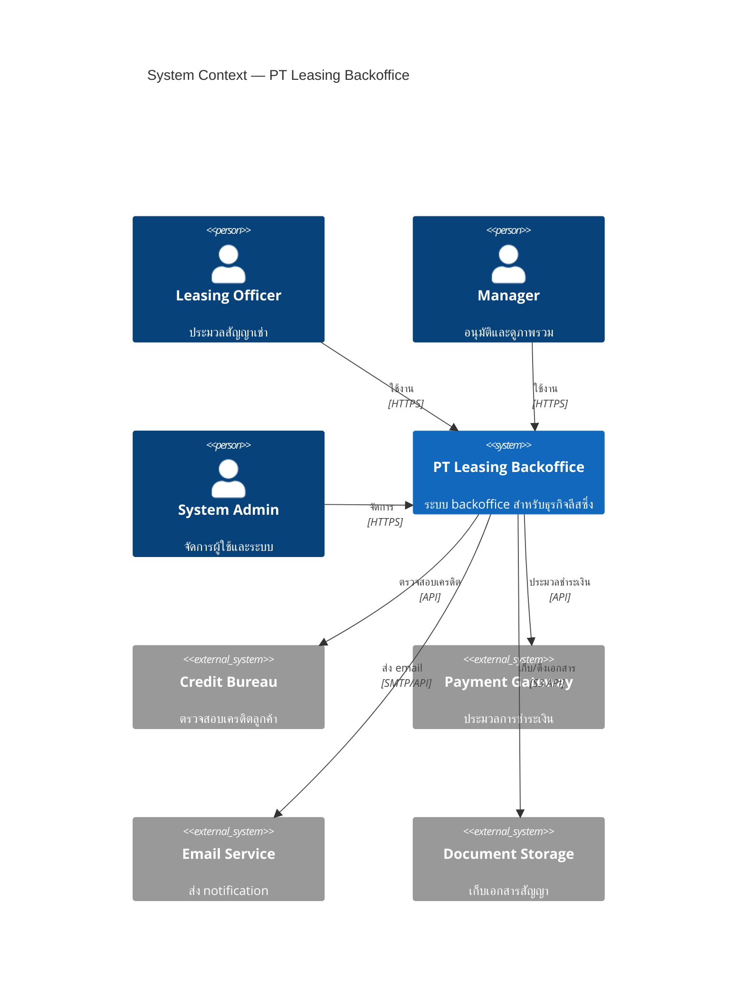
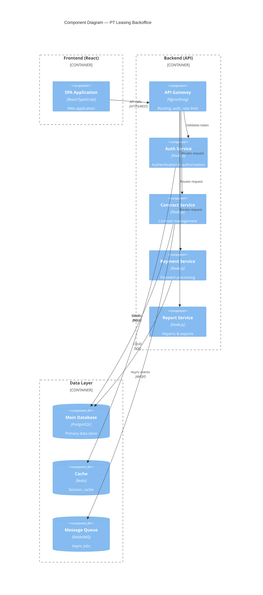
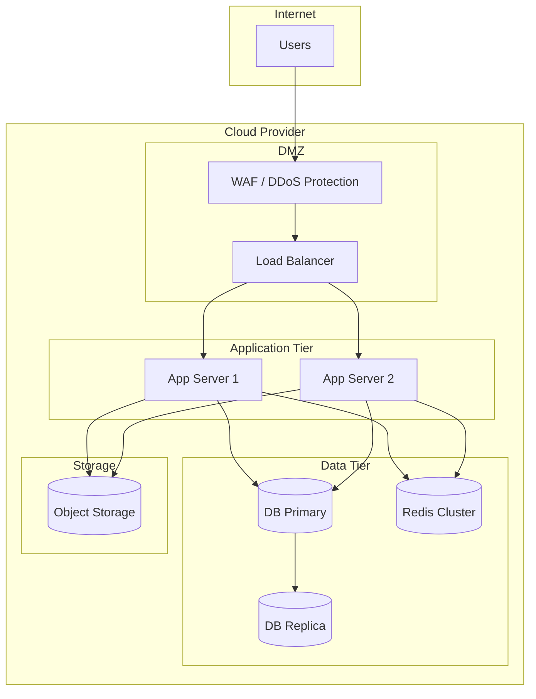

# Architecture: [System/Feature Name]
# เอกสารสถาปัตยกรรมระบบ

> **Version**: 0.1.0 | **Status**: Draft

---

## 1. System Context / บริบทของระบบ

### 1.1 Overview / ภาพรวม

*(อธิบาย context ของระบบ — อยู่ที่ไหนใน landscape ของ PT Leasing)*

### 1.2 System Context Diagram / ผังบริบทระบบ

---

## 2. Component Diagram / ผังส่วนประกอบ

---

## 3. Technology Choices / การเลือก Technology

| Layer | Technology | Version | Rationale |
|-------|-----------|---------|-----------|
| Frontend | React | 18.x | ทีมมีความชำนาญ, ecosystem ดี |
| Backend | Node.js (Express) | 20.x LTS | Fast development, JavaScript throughout |
| Database | PostgreSQL | 15.x | ACID compliant, JSON support |
| Cache | Redis | 7.x | Fast session/cache |
| Container | Docker + Kubernetes | - | Scalability, consistency |
| CI/CD | GitHub Actions | - | Repository อยู่ใน GitHub |
| API Documentation | OpenAPI 3.0 | - | Industry standard |
| Auth | JWT + OAuth2 | - | Stateless, scalable |

*(อ่าน rationale ละเอียดได้ที่ ADR documents)*

---

## 4. Infrastructure / โครงสร้างพื้นฐาน

### 4.1 Environment Overview

| Environment | Purpose | URL |
|-------------|---------|-----|
| Development | Local development | localhost |
| Staging | QA testing, UAT | https://staging.ptleasing.internal |
| Production | Live system | https://ptleasing.snocko-tech.com |

### 4.2 Infrastructure Diagram

### 4.3 Server Specifications

| Component | Spec | Count | Notes |
|-----------|------|-------|-------|
| App Server | 4 vCPU, 8GB RAM | 2 | Auto-scaling capable |
| DB Primary | 8 vCPU, 32GB RAM, 500GB SSD | 1 | |
| DB Replica | 8 vCPU, 32GB RAM, 500GB SSD | 1 | Read replica |
| Redis | 2 vCPU, 4GB RAM | 1 | |

---

## 5. Scalability Considerations / ข้อพิจารณาด้าน Scalability

### 5.1 Current Capacity

- Expected users: 50-100 concurrent
- Data volume: ~10,000 contracts/year
- Peak load: Month-end reporting

### 5.2 Scaling Strategy

| Trigger | Action |
|---------|--------|
| CPU > 70% for 5 min | Scale out app servers (add 1 instance) |
| Memory > 80% | Scale up app server size |
| DB connections > 80% | Add read replicas |
| Response time > 2s | Performance investigation |

### 5.3 Bottlenecks to Watch

- Database: slow queries during batch reports
- Cache miss rate: monitor Redis hit rate
- External API: credit bureau response time

---

## 6. Security Architecture / สถาปัตยกรรมด้านความปลอดภัย

*(ดูรายละเอียดใน docs/00-discovery/02-design/security/SECURITY_DESIGN.md)*

- **Authentication**: JWT + Refresh tokens
- **Authorization**: RBAC with least privilege
- **Data encryption**: TLS 1.2+ in transit, AES-256 at rest
- **Network**: WAF, private subnets for data tier
- **Audit**: All actions logged to centralized log system

---

*เอกสารนี้สร้างโดย PT Leasing SDLC Framework — templates/ARCHITECTURE.template.md*
