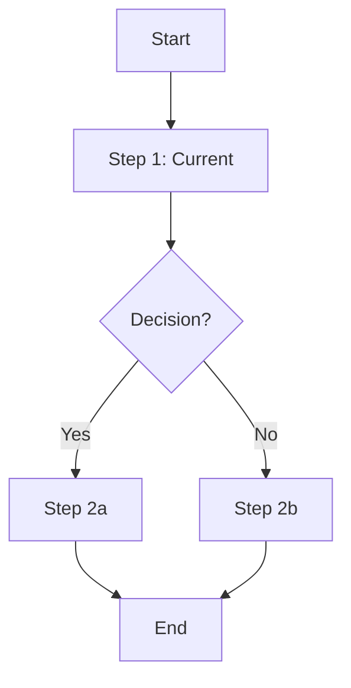
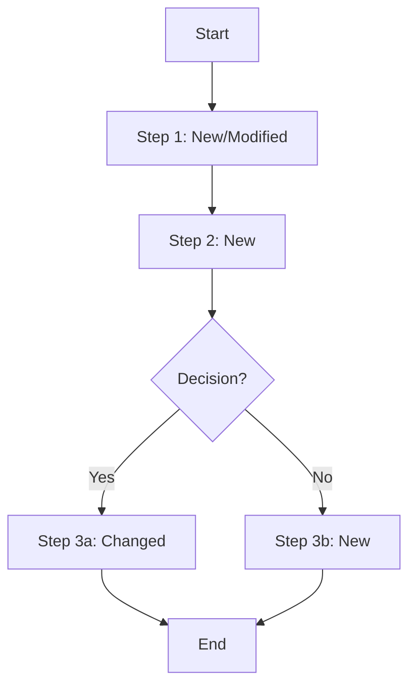

# Gap Analysis: [Change Name]
# การวิเคราะห์ช่องว่างระหว่าง As-Is และ To-Be

> **CR ID**: CR-XXX | **Feature**: F-XXX | **Version**: 0.1.0

---

## 1. Reference Documents / เอกสารอ้างอิง

| Document | Location | Version | Notes |
|----------|----------|---------|-------|
| BRD (CR) | `./BRD.md` | 0.1.0 | ที่มาของการเปลี่ยนแปลง |
| Original BRD | `../BRD.md` | X.Y.Z | BRD ต้นฉบับของ feature |
| System Design | `docs/00-discovery/02-design/system/SYSTEM_DESIGN.md` | | |
| Architecture | `docs/00-discovery/02-design/architecture/ARCHITECTURE.md` | | |
| Jira Issue | https://snocko-main.atlassian.net/jira/software/projects/PTL/issues/PTL-XXX | | |

---

## 2. As-Is Analysis / การวิเคราะห์สถานะปัจจุบัน

### 2.1 Current Business Process / กระบวนการธุรกิจปัจจุบัน

*(อธิบาย business process ปัจจุบันอย่างละเอียด)*

### 2.2 Current System Capabilities / ความสามารถของระบบปัจจุบัน

| Capability | Status | Notes |
|-----------|--------|-------|
| Capability A | Exists | |
| Capability B | Partial | เฉพาะบาง case |
| Capability C | Missing | ยังไม่มี |

### 2.3 Current Pain Points / จุดอ่อนปัจจุบัน

*(รายการปัญหาที่พบในสถานะปัจจุบัน)*
1. ปัญหา 1: ...
2. ปัญหา 2: ...
3. ปัญหา 3: ...

---

## 3. To-Be Analysis / การวิเคราะห์สถานะที่ต้องการ

### 3.1 Target Business Process / กระบวนการธุรกิจที่ต้องการ

*(อธิบาย business process ที่ต้องการหลังการเปลี่ยนแปลง)*

### 3.2 Required Capabilities / ความสามารถที่ต้องการ

| Capability | Priority | Notes |
|-----------|---------|-------|
| Capability X | Must Have | ต้องมีใน version นี้ |
| Capability Y | Should Have | ควรมี |
| Capability Z | Could Have | มีก็ดี |

---

## 4. Gap Analysis Table / ตารางวิเคราะห์ช่องว่าง

*(หัวใจของเอกสารนี้ — เปรียบเทียบ As-Is กับ To-Be)*

| Area | As-Is | To-Be | Gap Type | Impact | Priority |
|------|-------|-------|----------|--------|---------|
| Business Rule: BR-001 | กฎเดิม | กฎใหม่ | Modify | Medium | High |
| Feature: Login | มี basic login | ต้องการ SSO | Add | High | High |
| Data: Customer | เก็บ 10 fields | ต้องการ 15 fields | Extend | Medium | Medium |
| UI: Dashboard | แสดง table | ต้องการ chart | Modify | Low | Medium |
| API: GET /contracts | ส่งคืน 10 fields | ต้องการ 15 fields | Extend | Medium | High |
| DB: contracts table | ไม่มี column X | ต้องเพิ่ม column X | Add | High | High |

**Gap Types**:
- **Add** — เพิ่มใหม่
- **Modify** — แก้ไขที่มีอยู่
- **Remove** — ลบออก
- **Extend** — ขยายความสามารถที่มีอยู่
- **Replace** — แทนที่ด้วยสิ่งใหม่

---

## 5. Implications / ผลกระทบที่ตามมา

### 5.1 Technical Implications / ผลกระทบด้านเทคนิค

*(อธิบายว่า gaps ที่พบมีผลกระทบต่อระบบอย่างไร)*

- **Backend**: ต้องแก้ไข API X, Y เพิ่ม endpoint Z
- **Frontend**: ต้องแก้ไข screen A, B เพิ่ม component C
- **Database**: migration ที่ต้องทำ
- **Integration**: ระบบ 3rd party ที่ได้รับผลกระทบ

### 5.2 Process Implications / ผลกระทบต่อกระบวนการ

*(ผลกระทบต่อ business process, workflow, หรือ operations)*

### 5.3 People Implications / ผลกระทบต่อบุคลากร

*(ต้อง training, เปลี่ยน responsibility, หรือ hire ใหม่ไหม)*

---

## 6. Risk Analysis / การวิเคราะห์ความเสี่ยง

| Risk | Likelihood | Impact | Risk Score | Mitigation |
|------|-----------|--------|-----------|------------|
| Data migration fails | Medium | High | High | Test migration on staging first |
| Breaking change to API | High | High | Critical | Version the API, maintain backward compat |
| Timeline impact | Medium | Medium | Medium | Prioritize must-have gaps |

---

## 7. Estimated Effort / ประมาณการ effort

*(ประมาณ effort สำหรับแต่ละ gap — ละเอียดจะอยู่ใน stories)*

| Gap Area | Effort (days) | Team | Notes |
|----------|--------------|------|-------|
| Backend changes | X | Dev | |
| Frontend changes | X | Dev | |
| Database migration | X | Dev/DBA | |
| Testing | X | QA | |
| Documentation | X | BA/SA | |
| **Total Estimated** | **X days** | | |

**Confidence Level**: High / Medium / Low
*(Low = ยังมี unknown ที่ต้องสำรวจเพิ่ม)*

---

## 8. Recommendations / ข้อเสนอแนะ

*(ข้อเสนอแนะการดำเนินการต่อ)*

1. **ดำเนินการทันที**: gaps ที่มี priority Critical/High ทั้งหมด
2. **ทบทวน**: gaps ที่ impact ต่อ architecture ควรผ่าน architecture review ก่อน
3. **เลื่อนออกไป**: gaps ที่มี priority Could Have อาจพิจารณาใส่ release ถัดไป

---

*เอกสารนี้สร้างโดย PT Leasing SDLC Framework — templates/GAP_ANALYSIS.template.md*
